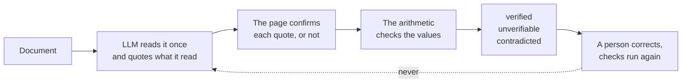
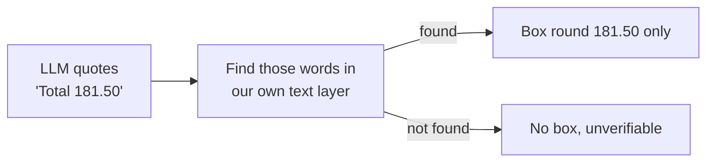
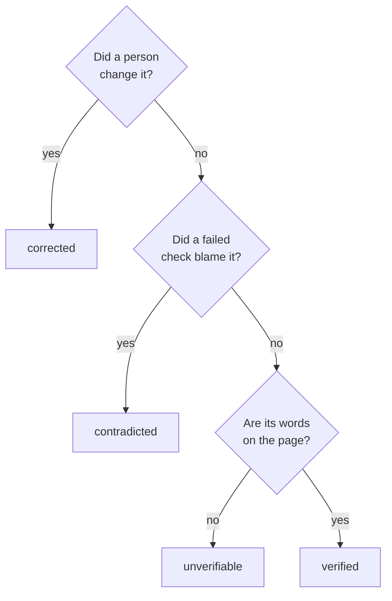

# Decisions

Why Holocron is built the way it is. Short sections, one decision each, with the reason and what it cost.

## Why it is called Holocron

I am a Star Wars fan. A [holocron](https://starwars.fandom.com/wiki/Holocron) is a small crystalline device that stores knowledge. That is what this is: a small thing that holds the records. I liked that a holocron does not just hold knowledge, it holds it in a way that can be trusted, which turned out to be the whole product.

## The problem I chose

The brief was wide: take messy documents and turn them into clean, structured data that can be searched and queried. Any document, any data. A brief that wide invites a demo that does a little of everything, and I did not want to build that, because a little of everything is what every document tool already shows.

So I picked one person and the documents that land on their desk. The person is a bookkeeper. The documents are invoices, receipts, and contracts. Three types, no more, and no way for a user to add a fourth.

Bookkeeping documents have a property most documents do not: they can be checked. An invoice carries its own arithmetic. Quantity times price is the line, the lines make the subtotal, subtotal and tax make the total. A contract carries its own consistency. The people named at the top sign at the bottom, the dates run in order, a term that is defined gets used. A news article or a slide deck carries none of that. Nothing inside it can tell you whether you read it right. I wanted documents that could argue back.

Why three and not one? One type would make this an invoice parser. Three cover both kinds of proof, arithmetic and consistency, and both kinds of input, clean PDF text and blurry photos read by OCR. That is enough to show the shape holds without pretending to cover the world. Every type gets the same treatment: the page confirms each value, the checks test them, and a person has the last word. A fourth type is a form and a list of checks, not a new system.

And why not let users define their own fields? Because then I could not write the checks, and without checks there is no way to say whether a value is right. All that is left is extraction, which is the easy part and the part every demo already does.

That is the thing I am actually trying to solve. Structured, queryable data is only worth querying if the numbers in it are right. A search over wrong data gives confident wrong answers, at scale, to people who trusted it. So Holocron is not about getting values out. It is about knowing which of the values that came out can be acted on, and showing the proof beside each one.

## The hard part I chose

Pulling values out of an invoice is not hard any more. One call to a good LLM, a large language model of the kind behind today's chat assistants, does it. The hard part is knowing which of those values are right, because a bookkeeping system that acts on a wrong number does damage before anyone notices.

So I did not build Holocron around the LLM. I built it around proof. The LLM reads the document once, and everything after that is about checking its answer without asking it again.

## Every value points at the page

A bookkeeper looking at a number wants to see where it came from. Not roughly where. Exactly where.

An LLM cannot tell you where a word sits on a page. Ask one for the position of a number and it will give you a plausible guess, and a guess drawn as a box looks exactly like proof. So I do not ask.

Instead I make my own map of the page first. For a PDF, the file already says what every word is and where it sits, so I read that. For a photo, OCR does the same job, which is software that reads printed text out of an image. Either way I end up with a list of every word on the page and the small rectangle it occupies. I call that the text layer.

Then the LLM reads the document, and for every value it gives back it must also quote the exact words it read the value from. I take that quote and look for those words in my text layer. If they are there, the highlight is the rectangle around them. If they are not, there is no highlight, and the value is marked unverifiable. This step of tying a value back to real words on the page is what I call grounding.

The highlight follows one strict rule. It covers the value's own words, all of them and nothing beside them, or it is not drawn at all. A box that is slightly off, or that takes in the label next to the number, would look like proof without being proof. That is worse than no box.

Being this strict found real mistakes while I was building. On one invoice a line said quantity 3, and the description on the same line read "3 SKUs". Both are a 3 on the page. The highlight landed on the wrong one. The fix was to make grounding aware of the whole document: once a value has claimed some words, no other value may claim the same ones, and a value in a table row prefers the match that sits on its own row.

The receipt photos among the samples show the honest side of this. The photos are blurry, the OCR reads the totals but not the item lines, so the totals get boxes and the item lines say unverifiable. Nothing pretends.

## Documents check themselves

The second kind of proof is arithmetic, the same checks a bookkeeper does by hand. Lines multiply. Lines add up to the subtotal. Subtotal, tax, and discount make the total. Dates are in order. Every party at the start of a contract signs at the end. Every defined term is used.

These are plain rules with no LLM in them, so they give the same answer every time and they run again in a blink after a correction. Money is compared in whole cents or paise, never in decimals, so a rounding difference can never look like an error or hide one.

A check that fails does two things. It marks the value it works out as contradicted, and it names the values that fed it, so the reviewer sees the whole line, not one red number.

## Trust has two inputs

A field ends in one of four states: verified, unverifiable, contradicted, or corrected. The inputs are the page and the checks. The LLM's own confidence is never one of them. Certainty is not evidence, and an LLM that is sure about a wrong number is the exact case this product exists for.

One rule I changed late. The LLM fills in a fixed form for each kind of document, and the invoice form has a slot for a discount, but most invoices have none. For a while a missing discount counted as unverifiable and pulled clean invoices down to "mostly verified". That badge was describing my form, not the document. Now a value the document never prints is neutral. It shows as "not on the document" and does not touch the badge, unless a check needed it, in which case the check fails and says so.

## A person has the last word

Review is the point. Any value can be corrected in place, from the keyboard. The correction is saved with the old value, every check runs again, and the badges change in front of you. The planted error in the sample invoice is there so you can do this in the first minute.

Corrections never go back to the LLM. Holocron is not learning from its users, and I want that to stay true until there is a deliberate, visible way to do it.

## One LLM, one call, a cap

Each document costs real money to read, so the cost had to be known and bounded before anything went live. I use one strong LLM and I hand it the form to fill in, so the answer comes back in exactly that shape every time, with nothing to parse or repair. It is one call per document, with every page image and its text.

My estimate was about three dollars for a workspace of twenty documents. Measured, it is about one dollar, because the LLM writes far less than I assumed. There is a monthly cap. When it is reached, new documents wait in the queue with a plain sentence saying why, and nothing already read is lost.

## No sign in, no account creation

There is no sign up form and no login. One shared access code opens the door, and past it each browser gets its own workspace, remembered by a cookie that the server signs so it cannot be forged.

I left accounts out because they are a different problem from the one I was solving. A sign in layer is well understood and can be added at any point. Building it now would have taken days away from proving what was read, which no one else would have built for me. A reviewer should also be looking at documents ten seconds after opening the link, and a sign up form is the surest way to lose them before that.

The settings page holds a link that reopens the workspace on another browser. Untouched workspaces are deleted after two weeks, files included. Limits on uploads, new workspaces, and requests keep one address from spending everyone's budget.

When accounts are needed, they slot in at the door. A workspace already stands on its own, so it can be owned by a user instead of a cookie without changing anything behind it.

## One server, queue in Postgres

Reading a document takes time, so the upload only puts the document on a waiting list and answers at once. A separate process, the worker, takes documents off that list one by one. The waiting list lives in the same Postgres database as everything else, using a small library called pg-boss, rather than in a separate queue system. That way the document and its place in the list are saved in one step, together or not at all. There is no way to end up with a document nobody will read, or a job for a document that does not exist.

Every attempt is a run with steps: received, rendered, text read, extracted, grounded, checked, done or failed. The timeline screen shows them with timings and errors. If the worker dies mid-document the job expires and is tried again, and the document's status lives in my own tables, never in the waiting list's, so a lost job can never make a document lie about where it is.

## A file is not a document

The second real upload was a two page Amazon order. It held two invoices from two sellers, and Holocron read the first and lost the second without a word. That is the worst kind of failure for a product whose job is to not lose things quietly.

So a file may now hold many documents. Before anything is read, a small, cheap LLM call looks at the pages and says how many documents there are and which pages belong to each. That is a reading task, so a cheap LLM does it well, and the answer is made safe before it is used: every page ends up in exactly one document, and a bad answer means one document with every page. Each document then gets its own row, fields, checks, badge, and place in the queue, sharing the file's pages. A one page file never asks the question.

## The samples

A stranger has to see it working before uploading anything. So every new workspace starts with seven documents already read: three invoices I wrote, two receipt photos from an open dataset, and two contracts under open licences. One invoice has a planted error. Every sample carries an expected answer file, and the tests run the pipeline over them with recorded LLM replies, so the suite is free to run and always gives the same result.

## How this scales

Today one worker reads one document at a time. The next step is letting it read a few at once, which is one setting. After that, more workers, which is one line of configuration, because the worker is the same program as the API started a different way. After that, more machines, with Postgres moved off the box. The LLM provider's rate and spend limits are the ceiling long before the server is. Putting Cloudflare in front is the first thing I would do for a real launch, for flood protection and caching of page images.

## What I left out, and what comes next

Left out on purpose: user accounts, saved table views, browser tests, and any scanning of uploaded files for content. If I had to cut further, in order: the timeline screen, the contract checks beyond parties and dates, search down to filter and sort, and photo receipts through OCR.

The first real invoice a friend uploaded was an Indian marketplace one, with two taxes at the foot and a discount on every line, and it lit up red. The form could not hold it, so the checks were honestly reporting that the numbers did not add up in the shape I had given them. I widened the form to hold the pieces every invoice can print, taxes one by one, a discount and a taxable value per line, a round off, and let the checks accept the arithmetic either way round. That is the pattern for every layout to come: the LLM reads anything, the form holds the pieces, and the checks only run on what is printed.

Known limits I would fix first: a photo in a script other than English comes out unverifiable, because the OCR is English only.

The longer view is more document types with the same three kinds of proof, a moderation step before uploads open to strangers, and a careful way to let corrections improve the reading without ever training on a customer's documents behind their back.
