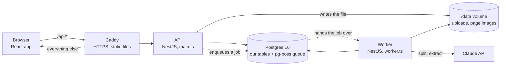
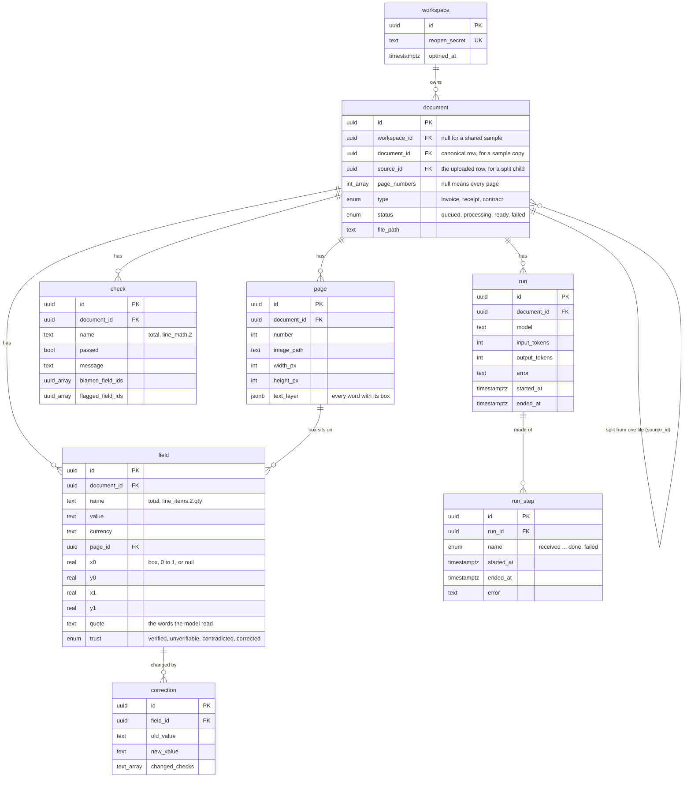

# How Holocron is built

This is the low level design. It says what the parts are, how a document moves through them, and what the tables hold. For why it is built this way, read [decisions.md](../decisions.md). For running it, read the [README](../README.md).

## The parts

Four containers run on one server, from `docker-compose.prod.yml`: `postgres`, `api`, `worker`, and `caddy`. The API and the worker are the same image with a different entry file. Caddy answers on 443, sends `/api/*` to the API on port 3000, and serves the built React app for every other path. Uploaded files and rendered page images live on one Docker volume mounted at `/data`. Postgres keeps its data on a second volume and also holds the job queue, so there is no separate queue service to run or watch.

The API never does slow work. It writes the file, inserts a row, enqueues a job, and answers. The worker picks the job up within two seconds and does the rest. The browser polls the document every two seconds while its status is `queued` or `processing`, and stops when it is `ready` or `failed`.

## The tables

Seven nouns, eight tables. The schema is in `apps/api/src/db/schema.ts` and the migrations in `drizzle/`. Things worth knowing that the diagram cannot say:

- **A workspace is a cookie, not an account.** The `hc_ws` cookie holds the workspace id, signed. `reopen_secret` is the one way back in from another browser.
- **Samples are stored once.** The canonical row of a sample has no workspace. Each workspace gets its own copy row that points back through `document_id`. Pages and runs hang off the canonical row and are shared. Fields and checks hang off the copy, because corrections belong to one workspace.
- **A file can hold several documents.** The uploaded row owns the pages. Each further document is its own row with `source_id` pointing at the uploaded row and `page_numbers` saying which pages are its. This is why a page's owner is always `document_id ?? source_id ?? id`.
- **A box is four numbers from 0 to 1**, origin top left, so it works at any zoom. All four are null when the value has no box.
- **Status lives in `document.status`**, never in pg-boss. The queue can lose a job and the row still says what is true.
- **Every foreign key cascades on delete**, so deleting a document row takes its pages, fields, checks, corrections, and runs with it in one statement.

## Life of a document

One job per document, one `run` row per attempt, one `run_step` row per step. The steps, in order, with what each one reads and writes:

1. **received.** The API has written the file under `/data`, inserted the `document` row as `queued`, opened a `run`, and put a job in pg-boss with the document id as its singleton key, so the same document is never in the queue twice. Jobs are grouped by workspace, so one busy workspace cannot starve another.
2. **rendered.** The worker draws each page to a PNG with pdf.js and `@napi-rs/canvas`, or resizes the image with sharp. It counts the pages before drawing anything and stops at 21.
3. **text_layer.** For a PDF, the words and their positions come from the PDF itself. For an image, or a PDF with no text, tesseract.js reads them. Either way every word gets a box, control characters are stripped, and the result is stored as `page.text_layer`.
4. **split.** A cheap model, Haiku, looks at the pages and answers one question: how many documents are in this file, and which pages belong to each. One document is the common answer and nothing changes. More than one means new `document` rows are inserted with `source_id` and `page_numbers`, each with its own run and its own job, and this run continues with the first document's pages only.
5. **extracted.** One call to Opus at medium effort with the page images and the text. The answer must match the Zod schema for the document type, enforced by structured outputs, so it always parses. Every value comes with the exact words the model read it from. Token counts go on the `run` row and count against the monthly cap.
6. **grounded.** For every value, find the quoted words in our own text layer and store the box. Details in the next section. A value whose quote is not on the page gets no box.
7. **checked.** Run the check list for the document type, store one `check` row per rule, work out each field's trust from the checks and the boxes, and set the document to `ready`.

If any step throws, the step and the run record the error in one plain sentence, the document becomes `failed`, and the review screen offers Try again. A retry opens a fresh run and starts from `received`. The timeline page reads `run_step` and shows every attempt.

Two cron jobs also run through pg-boss. At 03:00 UTC the cleanup removes workspaces untouched for 14 days, files and all. At 04:00 UTC the re-send finds documents that have sat in `queued` with no job and enqueues them again.

## Grounding

The model is never asked where a value is. It quotes what it read, and `ground()` in `apps/api/src/ground/ground.ts` finds those words on the page. The rules, in the order they apply:

- **Exact first.** Find every shortest run of words whose text equals the quote. Matches respect word boundaries, so the quantity 3 never matches the 3 inside 2026.
- **Then the value inside the quote.** The model often quotes a label along with the value. The box covers only the value's words.
- **Amounts by value.** The schema holds 181.50 as 181.5, so an amount matches any single word that says the same number, ignoring currency signs, commas, and sign.
- **Dates by meaning.** 2026-02-01 matches "1 February 2026" and "02/01/2026".
- **Nothing else.** No fuzzy matching. A miss is a miss and the field is unverifiable.

`groundAll()` in `apps/api/src/pipeline/ground-all.ts` runs this over every field in two passes. The first pass finds each value alone. The second goes back over them knowing what the others found: words another field already owns are off limits, a value in a table row prefers the match on the same line as the rest of its row, foot amounts such as subtotal and total prefer the lowest match on the page, a tax amount prefers the column under its own label, and header parties prefer the match nearest their label. When two fields land on the same words, the earlier field keeps them and the later one moves on.

## Checks and trust

`runChecks()` in `apps/api/src/checks/checks.ts` takes the flat list of fields and returns one result per rule. Each result says whether it passed, a sentence for the screen, which fields it blames when it fails, and which fields it merely read. An invoice runs line arithmetic per row, line tax per row, subtotal, tax lines, total, date order, one currency, and invoice number. A receipt runs the money rules and change. A contract runs the date rules, whether every party signed, and whether every defined term is used.

Trust has exactly two inputs: does the page back the value, and did a check blame it. The first rule that fits wins.

| Rule | Trust |
|---|---|
| A person changed the value | corrected |
| A failed check blames it | contradicted |
| Its quote was not found on the page | unverifiable |
| Otherwise | verified |

A field the document simply does not print, such as a discount on an invoice with none, is left out of the document's badge unless a check blames it. The document is `needs-review` if any field is contradicted, `mostly-verified` if any printed field is unverifiable, and `verified` otherwise. The queue sorts worst first.

A correction writes a `correction` row, updates the field, re-runs every check, and records which checks changed their answer. It never goes back to the model.

## The API

Every route is under `/api`, takes the `hc_ws` cookie, and only ever sees the caller's own workspace.

| Route | Does |
|---|---|
| `GET /health` | Answers ok. The other containers wait on it before they start. |
| `GET, POST /door` | Asks whether a code is needed, and checks one. Five wrong guesses lock the address for 15 minutes. |
| `POST /workspace`, `GET /workspace` | Makes a workspace and sets the cookie, or reads the current one. |
| `GET /workspace/settings`, `POST /workspace/reopen` | The reopen secret, and using one from another browser. |
| `POST /documents` | Upload. Checks the magic bytes, the size, the daily quota, and the free space, then enqueues. |
| `GET /documents`, `GET /documents/table?q=` | The queue and the searchable table. Search is a Postgres text index over the fields. |
| `GET /documents/:id`, `.../pages/:n/image`, `.../timeline` | One document with its pages, fields, and checks; a page image; the run steps. |
| `POST /documents/:id/retry`, `DELETE /documents/:id` | A fresh run, or removal with the files unless a split sibling still needs them. |
| `POST /fields/:id/correction` | A correction. |

## The web app

`apps/web` is React with TanStack Router, Query, and Table. There are seven screens: the door, the home screen with the upload box, the queue, the review screen, its timeline, the table, and settings. TanStack Query owns every fetch and the two second polling. The review screen draws the page image and puts one absolutely positioned box per field on top, using the 0 to 1 coordinates times the image's rendered size, so boxes stay put at any width. Keyboard shortcuts go through one hook, `useShortcuts`, and each screen passes the same list to the hint bar at its foot. `packages/shared` holds the Zod schemas, the limits, the screen messages, and the money formatting, so the API and the app cannot disagree about any of them.

## Limits, and where each one lives

| Limit | Value | Enforced in |
|---|---|---|
| Requests per address | 240 a minute | API middleware, in memory |
| New workspaces per address | 3 an hour | API, in memory |
| Uploads per workspace | 10 a day, split children not counted | Upload route, counted from the table |
| File size, type, pages | 10 MB, PDF PNG JPEG by magic bytes, 20 pages | Upload route, and the render step |
| Free disk | 2 GB floor | Upload route |
| Model spend | $15 a month | Before every model call, summed from `run` |
| Wrong access codes | 5, then 15 minutes | Door service |
| Workspace life | 14 days untouched | Cleanup cron |

Each limit has one number and one sentence, both in `packages/shared/src/limits.ts`, so what is enforced and what the person reads can never drift apart.

## Key technical decisions, short form

The long versions with their costs are in decisions.md. The one line each:

| Decision | Choice | Because |
|---|---|---|
| Where values point | Our own text layer, not model coordinates | A model guesses positions. The text layer knows them. |
| Model output | Structured outputs from the Zod schema | The answer always parses, and the schema is the contract both sides share. |
| Trust | Page and checks only, never model confidence | Confidence is a feeling. A failed sum is a fact. |
| Queue | pg-boss inside Postgres | One less service, transactions across job and row, and the row stays the truth. |
| Accounts | None. A signed cookie and a reopen secret | Nothing to leak, nothing to reset, and a bookkeeper can start in one click. |
| Files | On a Docker volume, not object storage | One server, one backup, and the worker reads them off local disk. |
| Documents in a file | A cheap model decides, then one row per document | Most files hold one document. Splitting must not cost what reading does. |
| Frontend state | TanStack Query with polling, React Compiler on | No hand written caching, no hand written memoisation. |
| Deploy | One server, Docker Compose, Caddy | Fits the load by a wide margin and can be understood in an afternoon. |
