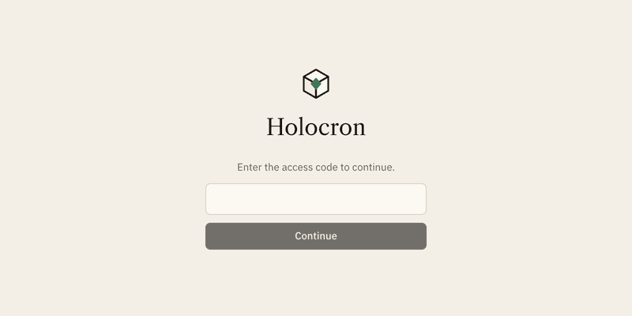
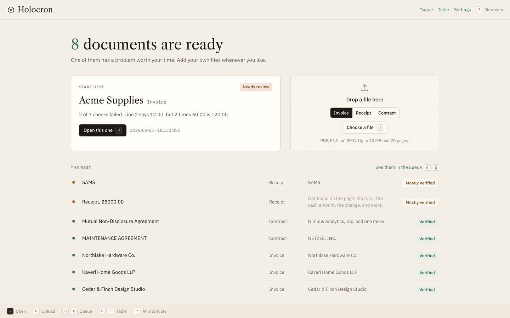
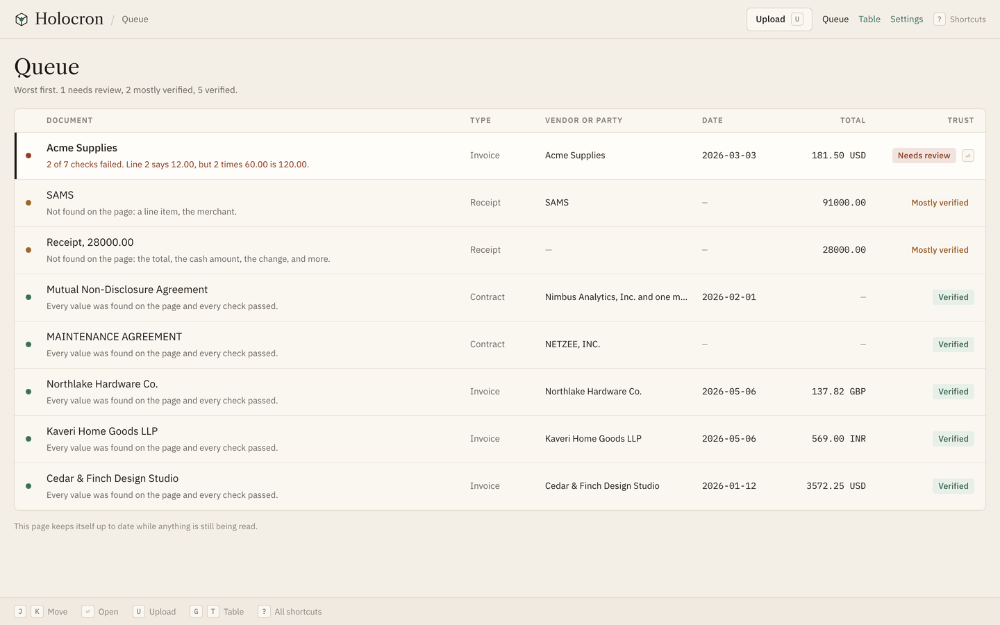
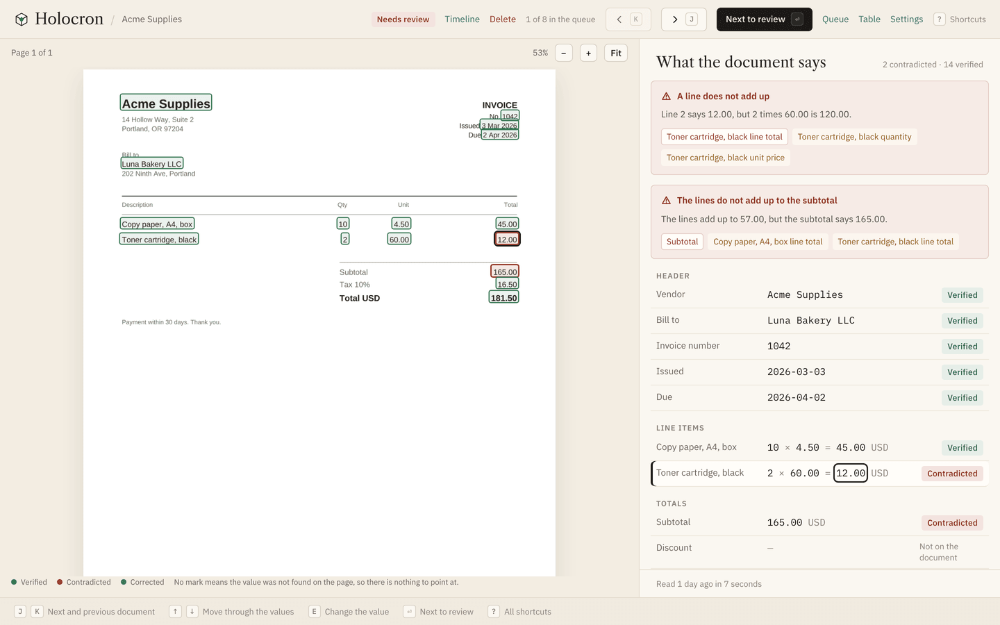
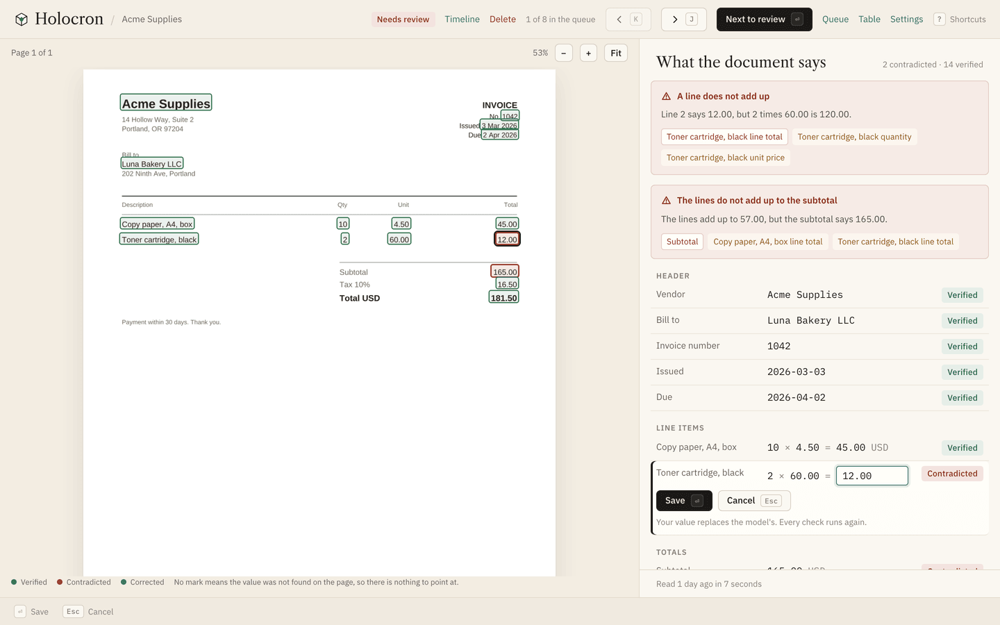
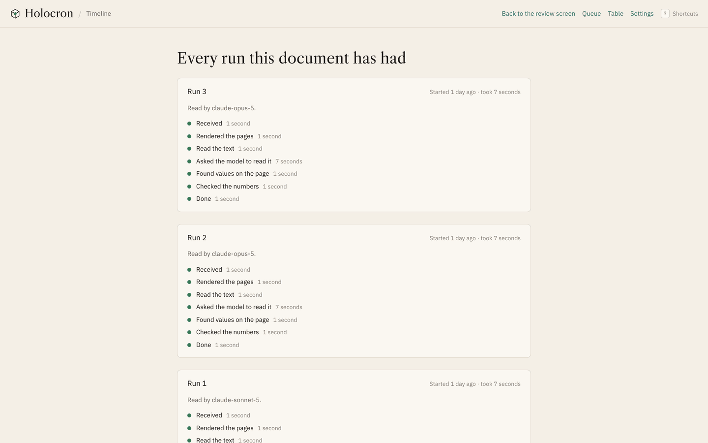
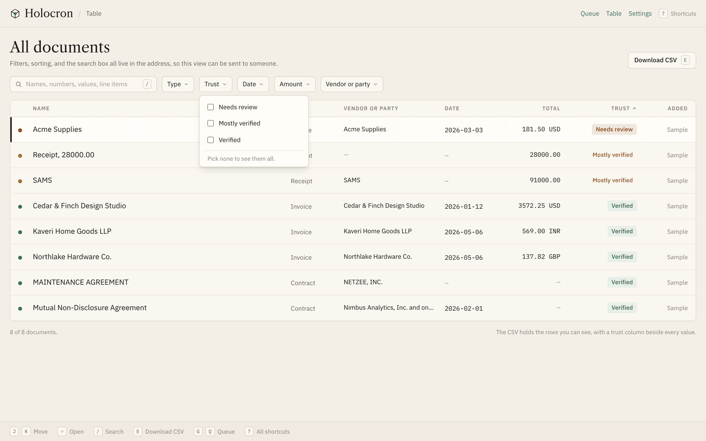
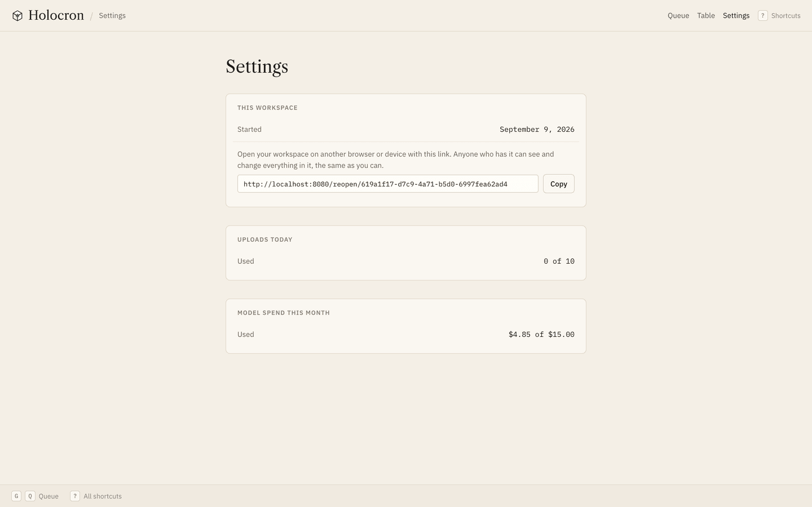

# Using Holocron

A walk through the product, screen by screen, in the order a person meets them. Every screen works from the keyboard, and the keys for the screen you are on are printed along its foot.

## The door

One shared access code opens the site. There is no sign up and no login. Past the door, each browser gets its own workspace, remembered by a cookie, and nothing you do is visible to anyone else.

## Home

Your workspace opens with eight sample documents already read: four invoices, two receipt photos, and two contracts. One of the invoices has a wrong number planted in it, so there is something to fix in the first minute. The heading says how many documents are ready and how many need your attention.

The box on the right takes uploads. Drop a PDF, PNG, or JPEG on it, press U, or click it. A new document appears in the list as queued, becomes working within a couple of seconds, and is ready in about ten. If a file holds more than one document, such as an order with two sellers' invoices, each becomes its own document.

## Queue

Every document in the workspace, worst first. Each row shows the name, the type, the vendor or party, the date, the amount, and a trust badge, with one line under the name saying why: "2 of 7 checks failed. Line 2 says 12.00, but 2 times 60.00 is 120.00." or "Every value was found on the page and every check passed." J and K move down and up, Enter opens the document under the cursor. The page keeps itself up to date while anything is still being read.

## Review screen

The document on the left, what was read from it on the right.

Every value on the right that was found on the page has a box around it on the left. Pick a value with the arrow keys and the page scrolls to its box. The box is exactly the words the value was read from, nothing more. A value with no box was not found on the page, and its badge says unverifiable.

Under the values are the checks: does each line multiply, do the lines add up to the subtotal, do subtotal and tax make the total, are the dates in order. A failed check turns the value it works out red and names the values that fed it, so you see the whole line, not one number.

Press E on any value to change it, Enter to save, Escape to cancel. The change is saved with the old value, every check runs again, and the badges update in front of you. On the planted invoice, fixing the toner line from 12.00 to 120.00 turns the line check and the subtotal check green together.

The top bar has the document's badge, a link to its timeline, Delete, and your place in the queue. Enter jumps to the next document that needs review, J and K step through the queue without leaving the screen. If a file was split into several documents, a line beside the page count says where the other pages went, with a link.

## Timeline

Every attempt to read this document, step by step: received, rendered, text read, split, extracted, grounded, checked. Each step has its timing, and a step that failed has its error in one plain sentence. A failed document has a Try again button here and on the review screen.

## Table

Every value of every document in one grid, for the questions the queue cannot answer. Filter by type, trust, date, amount, or vendor. Sort any column. Press / and type to search, which looks through every value on every document, including line items. E downloads what you can see as a CSV, with a trust column beside every value, so the trust travels with the data.

## Settings

A link that reopens this workspace in another browser or on another device, the uploads used today, and the month's model spend against its cap. Workspaces untouched for 14 days are deleted, files included.

## Keys

The keys for the screen you are on are printed along its foot. The ones worth knowing:

| Key | Does |
|---|---|
| J, K | Next and previous document |
| Enter | Open, or on the review screen, next to review |
| Up, Down | Move through the values |
| E | Change the value, or on the table, download the CSV |
| / | Search the table |
| U | Upload |
| G then Q | Go to the queue |
| G then T | Go to the table |
| Escape | Cancel |

## The limits you might meet

Each one shows up on screen in plain words when you hit it.

| Limit | Value |
|---|---|
| File size | 10 MB |
| Pages per document | 20 |
| Uploads per workspace | 10 a day |
| LLM spend | $15 a month, then new documents wait |
